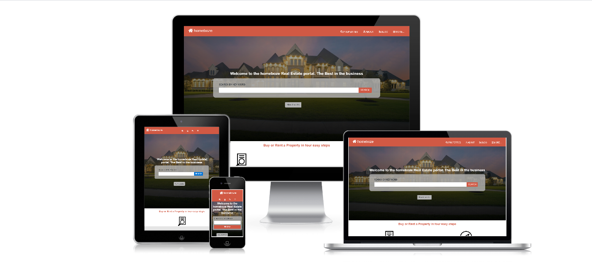

# HTML-CSS-captsion

This project has 3 pages, namely: home page, results page, and details page. It is completely responsive and targets 3 breakpoints. This project also has break pionts of 767px for tablet view and 1024px for desktop view.

## Screenshot of our cloned website

## Buit with

- HTML
- CSS3
- Font awesome icons
- Bootstrap

## live Demo

Click! [Here](https://raw.githack.com/sempermort/NewyorkTimes/Developing/Index.html)

## Authors
- 👤 Ralph Oburu [Ralph](https://github.com/Ralph-1) 

## Show your support

Give a ⭐️ if you like this project!

## 📝 License

This project is [MIT]licensed.