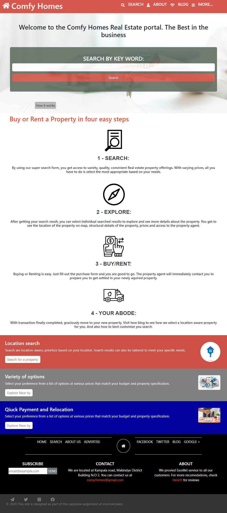

# HTML-CSS-captsion

This project has 3 pages, namely: home page, results page, and details page. It is completely responsive and targets 3 breakpoints. This project also has break points of 767px for tablet view and 1024px for desktop view.

## Screenshot of our cloned website

## Buit with

- HTML
- CSS3
- Font awesome icons
- Bootstrap

## Getting Started

 To get a local copy up and running follow these simple steps
- git clone https://github.com/Ralph-1/HTML-CSS-captsion
- cd HTML-CSS-captsion
- git checkout -b real-estate-site
- git pull
- If you have vscode live server installed, run it and open.

## Loom video
Click [Here](https://www.loom.com/share/5dc8875f01c04416a1313c2d1c924eb5)

## live Demo

Click! [Here](https://raw.githack.com/Ralph-1/HTML-CSS-captsion/real-estate-site/index.html)

## Authors
- 👤 Ralph Oburu [Ralph](https://github.com/Ralph-1) 

## Show your support

Give a ⭐️ if you like this project!

## 📝 License

This project is [MIT]licensed.